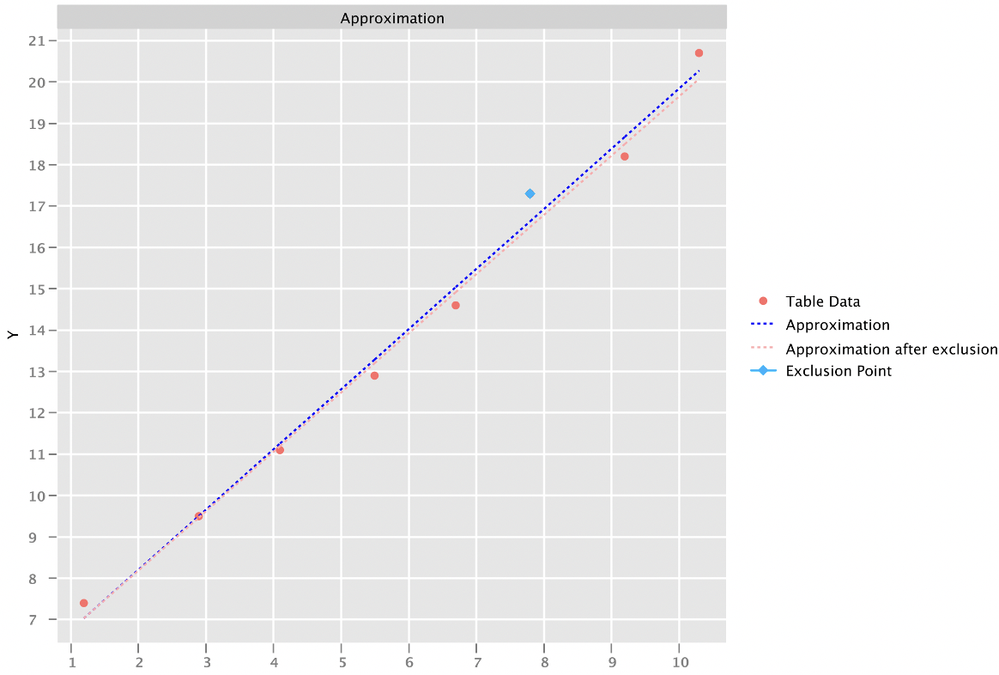
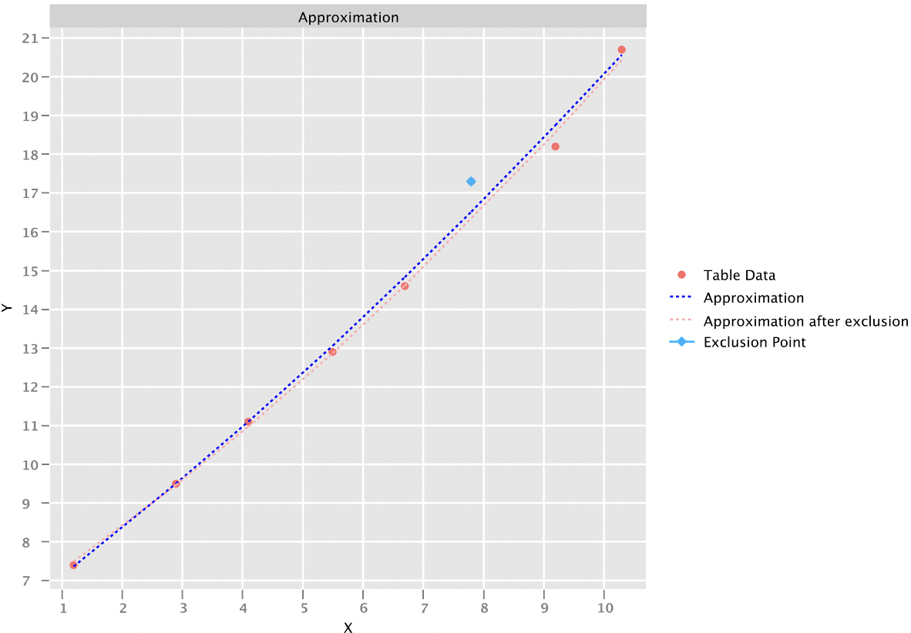
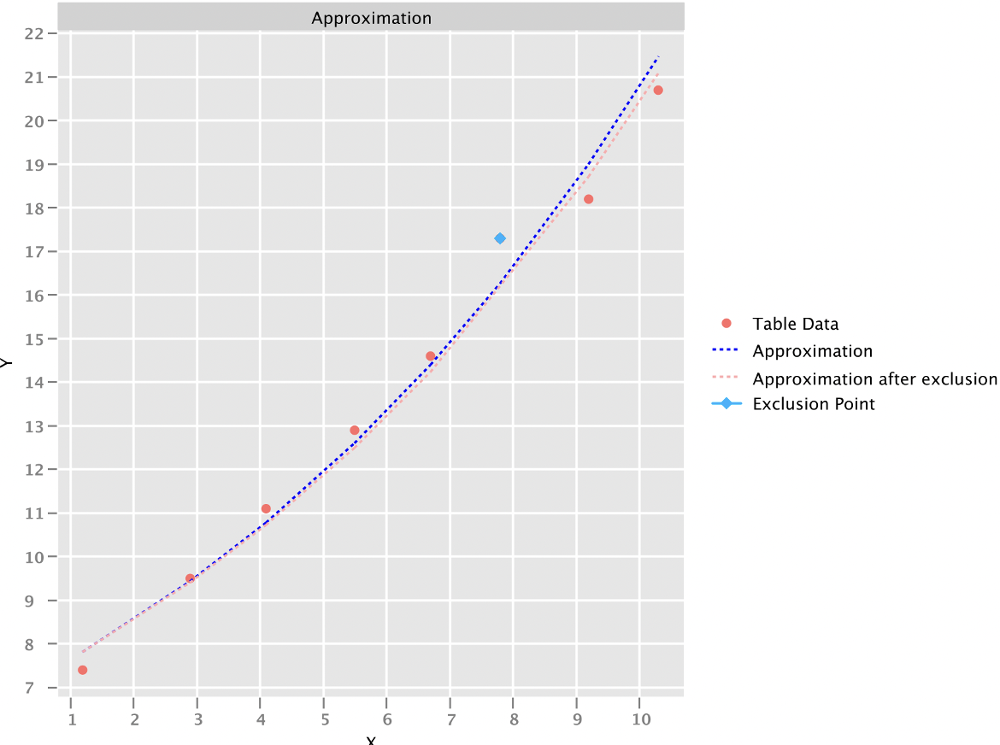

## Лабораторная работа 4
### Аппроксимация методом наименьших квадратов
Набор точек должен представлять собой некоторое количество пар (x; y) полученных из какой-то существующей функции.
Чтобы сгенерировать такой набор данных , я использую подготовленную функцию, поведение которой вам уже известно.

Для варианта аппроксимации следует применить метод аппроксимации дважды: второй раз метод должен быть запущен на укороченном списке входных точек, при чём исключена должна быть точка, имеющая наибольший квадрат отклонения после первого запуска.
Иначе говоря, алгоритм, следующий:
* Задается произвольный (полученный ранее) набор значений пар (𝑥;𝑦).
* Задается аппроксимирующая функция
* Рассчитываются программой коэффициенты аппроксимирующей функции.
* Производится поиск точки с наибольшим отклонением от значения, полученного при помощи аппроксимирующего многочлена.
* Найденная точка исключается и производится пересчёт коэффициентов аппроксимирующего многочлена
* Строится график, содержащий в себе две функции (1 - до исключения, 2 - после исключения и пересчёта) и набор заданных изначально точек (пар значений (𝑥,𝑦)).
* Помимо этого, отдельно на экран выводятся полученные значения аппроксимирующих коэффициентов.

В качестве аппроксимирующих функция в моей работе реализованы:
* Линейная
* Квадратичная
* Экспоненциальная

Для расчёта СЛАУ я использую метод Гаусса из [лабораторной работы 1](https://github.com/Matveezy/Computational-Math/tree/main/CompMathLab1).

**Линейная аппроксимация**
  

**Квадратичная**

**Экспоненциальная**
